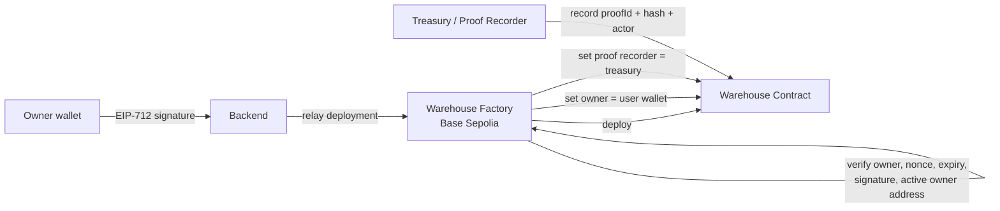
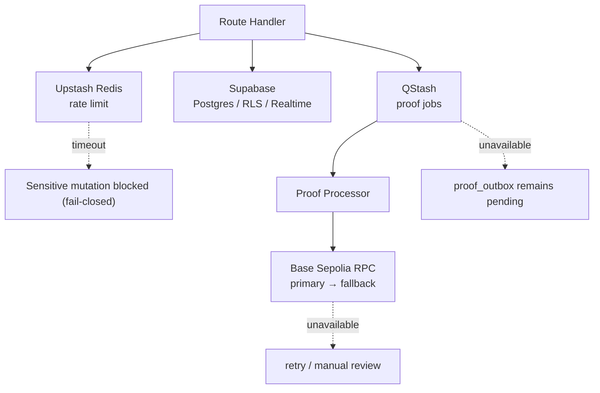

# ARSITEKTUR.md

**Status:** Locked
**Last Updated:** 2026-08-13
**Companion to:** `PRD.md`, `TECHSTACK.md`

---

## Daftar Isi

1. [High-Level Architecture & Trust Boundaries](#1-high-level-architecture--trust-boundaries)
2. [Definisi Trust Boundary](#2-definisi-trust-boundary)
3. [Matrix Tanggung Jawab Komponen](#3-matrix-tanggung-jawab-komponen)
4. [Data Model](#4-data-model)
5. [Blockchain & Contract Flow](#5-blockchain--contract-flow)
6. [Read Path, Realtime, dan UX State](#6-read-path-realtime-dan-ux-state)
7. [Operasi Free-Tier dan Resilience](#7-operasi-free-tier-dan-resilience)
8. [Testing, CI/CD, dan Acceptance](#8-testing-cicd-dan-acceptance)

---

## 1. High-Level Architecture & Trust Boundaries

Sistem ini dirancang menggunakan arsitektur **Hybrid Web2/Web3 dengan pattern BFF (Backend-for-Frontend)**. Seluruh komponen dibagi ke dalam zona kepercayaan (_trust zone_) yang tegas untuk mencegah eksploitasi data atau manipulasi transaksi.

```text
[ UNTRUSTED ZONE ]          [ TRUSTED SERVER ZONE ]             [ DECENTRALIZED ZONE ]
 ┌────────────────┐          ┌──────────────────────┐            ┌────────────────────┐
 │  Browser / UI  │          │ Next.js Route Handler│            │ Base Sepolia (L2)  │
 │   (Client)     │          │        (BFF)         │            │  Smart Contracts   │
 └───────┬────────┘          └──────────┬───────────┘            └─────────▲──────────┘
         │                              │                                  │
         │ (HTTP + Bearer JWT)          │ (Direct Query / RPC)             │ (Viem / Treasury Signer)
         ▼                              ▼                                  │
 ┌────────────────┐          ┌──────────────────────┐                      │
 │ Supabase Auth  │          │ Supabase DB + RLS    │                      │
 │  → Privy       │          │ + Outbox (QStash)    │──────────────────────┘
 │  custom-auth   │          └──────────────────────┘
 └────────────────┘
```

Alur identitas: **Supabase Auth mengeluarkan JWT → Privy menerima token itu sebagai custom-auth session** untuk layer wallet. Ini bukan dua sistem paralel — ada dependency satu arah (lihat `TECHSTACK.md` §2).

Proses blockchain (panah `Route Handler → Treasury → Base Sepolia`) **tidak terjadi secara sinkron dalam siklus request-response HTTP** milik Route Handler yang melayani user. Mekanisme sebenarnya melalui job queue (QStash) dan Proof Job Processor terpisah — lihat §5 dan §7.

---

## 2. Definisi Trust Boundary

### 🛡️ Boundary A: Client ↔ Route Handler (BFF)

- **Tingkat Kepercayaan:** Untrusted → Highly Trusted.
- **Ancaman Utama:** CSRF, Replay Attack, Input Injection, Unauthorized Access, Spoofing Wallet.
- **Mekanisme Keamanan:**
  - Validasi JWT Supabase melalui HTTP Authorization Header (`Bearer <token>`).
  - Validasi skema payload ketat menggunakan **Zod**.
  - Rate limiting berbasis IP dan User ID via **Upstash Redis** (fail-closed untuk mutasi sensitif).
  - Pemeriksaan keanggotaan warehouse (_membership_) dan peranan user (_role permission check_) secara eksplisit di layer aplikasi.

### 🛡️ Boundary B: Route Handler (BFF) ↔ Supabase Database

- **Tingkat Kepercayaan:** Trusted Server → Secure Storage.
- **Ancaman Utama:** Data Leakage via Application Bug, Privilege Escalation.
- **Mekanisme Keamanan:**
  - Pencatatan konteks user untuk audit trail.
  - **PostgreSQL RLS** aktif sebagai _defense-in-depth_ (mencegah akses langsung jika ada kebocoran pada query kustom).
  - Penggunaan transaksi terisolasi (_database transactions_) saat menulis ke _business tables_ dan _outbox table_.

### 🛡️ Boundary C: Proof Job Processor / Treasury ↔ Base Sepolia RPC

- **Tingkat Kepercayaan:** Trusted Server → Public Immutable Ledger.
- **Ancaman Utama:** Double-spending/Replay, Out-of-order Transaction Execution, RPC Downtime/Spam, Gas Exhaustion.
- **Mekanisme Keamanan:**
  - Penggunaan **JCS RFC 8785 + Keccak-256** untuk memverifikasi keabsahan _payload hash_ sebelum disubmit ke smart contract (lihat §5 untuk model verifikasi ulang hash).
  - Penyimpanan _private key_ Treasury secara eksklusif di server environment variable (divalidasi `@t3-oss/env-nextjs`).
  - Mekanisme retry otomatis dengan strategi exponential backoff dan fallback RPC.

---

## 3. Matrix Tanggung Jawab Komponen

| Komponen                           | Tanggung Jawab Utama                                                                                                                                                                                                                      | Hal yang **DILARANG** Dilakukan                                                                                                                                                                             |
| ---------------------------------- | ----------------------------------------------------------------------------------------------------------------------------------------------------------------------------------------------------------------------------------------- | ----------------------------------------------------------------------------------------------------------------------------------------------------------------------------------------------------------- |
| **Client (Browser / Next.js UI)**  | Render state UI, charts, toast. Menangani auth flow (Email/Google via Supabase, Wallet via Privy). Meminta tanda tangan message/transaksi dari user wallet.                                                                               | ❌ Menentukan permission/role user.<br>❌ Menghitung hash RFC 8785 untuk konsensus outbox.<br>❌ Mengeksekusi mutasi langsung ke Database tanpa BFF.                                                        |
| **Route Handler (BFF)**            | Eksekusi otorisasi tingkat lanjut (JWT + Warehouse + Role). Menjalankan rate limiting. Menghasilkan canonical JSON (RFC 8785) & hash proof. Menulis data ke database & Outbox table secara atomic. Sanitasi & format log JSON via `pino`. | ❌ Menyimpan private key user.<br>❌ Memercayai data mentah dari client tanpa validasi Zod.<br>❌ Log data sensitif (JWT token, private key, signature mentah).                                             |
| **Supabase (DB & Auth)**           | Manajemen sesi & JWT issuance (asymmetric JWKS). Penyimpanan state relasional (PostgreSQL). Penegakan RLS sebagai safety net.                                                                                                             | ❌ Menjadi primary layer otorisasi alur bisnis kompleks.<br>❌ Mengeksekusi logika smart contract secara langsung.                                                                                          |
| **Privy**                          | Mengelola embedded wallet & koneksi external wallet. Autentikasi custom session layer Web3. Menyediakan interface penandatanganan pesan (_signMessage_).                                                                                  | ❌ Mengelola permission warehouse user.<br>❌ Mengontrol database aplikasi.                                                                                                                                 |
| **Proof Job Processor / Treasury** | Menghitung ulang hash dari payload immutable sebelum submit. Mengeksekusi transaksi smart contract dari Outbox Table. Membayar gas fee atas nama warehouse/sistem.                                                                        | ❌ Mengubah isi payload proof yang dibuat oleh BFF.<br>❌ Beroperasi tanpa batas EVM account nonce/queue terstruktur.<br>❌ Submit ke chain bila hash hasil hitung ulang tidak cocok dengan hash tersimpan. |
| **Base Sepolia Smart Contract**    | Memverifikasi proof hash & menjaga _state of truth_ ownership/persediaan secara _immutable_. Memastikan keabsahan instruksi via Factory & Warehouse Contracts.                                                                            | ❌ Menyimpan metadata non-esensial (nama gambar, deskripsi CSV, dsb).                                                                                                                                       |

---

## 4. Data Model

### 4.1 Tabel Inti

| Tabel                   | Peran                                                                                                                       |
| ----------------------- | --------------------------------------------------------------------------------------------------------------------------- |
| `users`                 | Profil aplikasi, terikat ke `auth.users` Supabase dan Privy user ID.                                                        |
| `wallets`               | Riwayat embedded/external wallet; tepat satu primary aktif per user.                                                        |
| `warehouses`            | Warehouse code, `owner_user_id`, `on_chain_owner_wallet_id`/address, status active/suspended, alamat contract Base Sepolia. |
| `warehouse_deployments` | Lifecycle EIP-712 deployment, `deploymentNonce`, signature metadata, tx hash, dan error.                                    |
| `memberships`           | User–warehouse–role (OWNER, MANAGER, STAFF, AUDITOR, VIEWER).                                                               |
| `join_requests`         | Request join berstatus pending/approved/rejected/cancelled.                                                                 |
| `products`              | SKU unik per warehouse, unit immutable setelah movement, low-stock threshold, status active/archived.                       |
| `inventory_balances`    | Saldo stok terkini per product; `quantity NUMERIC(24,3)` dan `version`. **Bukan ledger.**                                   |
| `stock_movements`       | Ledger immutable Stock In/Out/Adjustment/Reversal; quantity canonical, actor, reason/reference, relasi reversal.            |
| `proofs`                | Payload versi, hash Keccak-256, status proof, tx hash, confirmation count, retry/error state.                               |
| `proof_outbox`          | Job durable untuk dispatch ke QStash, lease, attempt count, jadwal retry.                                                   |
| `idempotency_records`   | Key UUID, fingerprint request, respons final, expired 24 jam.                                                               |
| `audit_logs`            | Peristiwa keamanan dan perubahan penting yang append-only.                                                                  |
| `faucet_claims`         | Klaim test ETH per wallet/user, status, tx hash, waktu eligible berikutnya.                                                 |
| `notifications`         | In-app notification yang ditargetkan ke user.                                                                               |

### 4.2 Aturan Integritas

- `inventory_balances` hanya berubah lewat PostgreSQL function atomik. Tidak ada update stok langsung dari browser atau Route Handler biasa.
- Dalam transaksi database yang sama: buat `stock_movement` → ubah saldo kondisional → tambah audit log → buat `proof` + `proof_outbox`.
- Stock In/Out langsung berstatus `committed`; Adjustment/Reversal diawali `pending_approval` dan baru menjadi `committed` setelah Owner/Manager menyetujui.
- `stock_movements`, `proofs`, dan `audit_logs` append-only. Koreksi tidak mengubah row lama.
- Semua quantity disimpan `NUMERIC(24,3)`; payload proof menyimpannya sebagai string decimal kanonis (misal `"2.500"`).
- Semua tabel tenant memiliki `warehouse_id` bila relevan, RLS aktif, foreign key, unique index sesuai scope warehouse, timestamp UTC.
- Proof hanya dibuat untuk movement `committed`; **status proof tidak pernah menentukan valid/tidaknya stok yang sudah committed.**

### 4.3 Unit Produk Immutable

`products.unit` tidak boleh berubah setelah produk memiliki `stock_movements`, ditegakkan di **level database**:

- Database memakai `BEFORE UPDATE OF unit` trigger yang menolak perubahan bila produk sudah memiliki `stock_movements`.
- Seluruh pembuatan movement melalui PostgreSQL function atomik yang mengunci row produk (`FOR UPDATE`) sebelum menulis ledger/saldo.
- Movement lebih dulu → perubahan unit ditolak trigger. Perubahan unit lebih dulu → movement berikutnya hanya bisa memakai unit baru. Tidak ada celah dua transaksi mengubah unit dan membuat history dengan interpretasi berbeda.
- Route Handler tetap memvalidasi lebih awal untuk UX (mengecek apakah produk sudah memiliki movement sebelum menerima perubahan unit), tetapi **trigger database adalah penegak final**.

### 4.4 Primary Wallet vs On-Chain Owner

- **User tanpa warehouse owner:** primary wallet hanya menentukan wallet aktif untuk signing dan boleh diganti setelah verifikasi kepemilikan wallet.
- **Owner warehouse:** primary wallet harus sama dengan `on_chain_owner_wallet`. Owner tidak dapat mengganti primary wallet secara langsung.
- Perubahan wallet untuk Owner adalah flow **Owner Wallet Migration / Ownership Transfer** eksplisit: wallet lama mengotorisasi transfer ke wallet baru → transaksi on-chain confirmed → `warehouse.on_chain_owner_wallet` dan `wallets.is_primary` diperbarui **atomik di database** oleh Proof Job Processor (bukan Route Handler yang serve request awal — mengikuti pola async yang sama seperti submit proof lain).
- Tidak ada kondisi valid ketika UI menganggap wallet B sebagai primary Owner sementara kontrak masih dimiliki wallet A.
- `warehouses` menyimpan `owner_user_id` (siapa user aplikasi yang punya) dan `on_chain_owner_wallet_id`/address (address yang tercatat di kontrak) sebagai kolom terpisah agar keduanya tetap jelas dan dapat diaudit.

---

## 5. Blockchain & Contract Flow



- Factory dan Warehouse Contract bersifat **immutable pada v1**.
- Factory memverifikasi EIP-712 `owner`, `warehouseCodeHash`, `deploymentNonce`, dan `expiry`; `chainId` serta Factory address terikat pada domain separator.
- `deploymentNonce` bersumber dari Factory **on-chain**. `idempotencyKey` hanya berada di database dan tidak menggantikannya.
- Treasury membayar test gas dan hanya menjadi **Proof Recorder**, bukan Owner.
- Warehouse Contract menyimpan proof minimal: `proofId`, hash, actor wallet, tipe event, timestamp, tx metadata. **Data inventory mentah tidak masuk chain.**
- Contract mencegah proof ID dicatat dua kali agar job delivery bersifat idempotent.
- EVM hanya mengenal address, bukan user Supabase. Factory menegakkan **satu warehouse aktif per owner address** (on-chain); database/Route Handler menegakkan **satu warehouse aktif per user aplikasi** (off-chain). Dua enforcement dengan unit identitas berbeda, dijaga konsisten lewat sinkronisasi wallet-owner (§4.4).
- Owner wallet migration adalah transfer ownership eksplisit on-chain. Setelah confirmed, backend menyinkronkan `on_chain_owner_wallet` dan primary wallet; tidak ada perubahan wallet diam-diam.
- Role Owner/Manager/Staff/Auditor/Viewer dikelola **off-chain**. Kontrak hanya mengelola owner address dan Proof Recorder; backend adalah boundary izin inventory.

### 5.1 Hash Integrity Model (BFF → Database → Worker)

- **BFF** membangun payload proof kanonis dan hash (JCS RFC 8785 + Keccak-256) **saat proof/outbox dibuat**, dalam transaksi yang sama dengan movement.
- Payload dan hash bersifat **immutable** setelah tersimpan di database.
- **Proof Job Processor** wajib **menghitung ulang hash** dari payload tersimpan **tepat sebelum submit** ke smart contract, dan membandingkannya dengan hash yang tersimpan.
- Bila **mismatch**: jangan kirim ke blockchain. Tandai `manual_review` dan buat audit log. Mismatch adalah sinyal data corruption atau tampering — bukan kegagalan jaringan biasa yang boleh di-retry otomatis.

Ini memberi pemeriksaan integritas eksplisit lintas boundary BFF → database → worker, dengan overhead minimal (satu operasi hash tambahan).

---

## 6. Read Path, Realtime, dan UX State

- Halaman authenticated selalu **dynamic**; tidak memakai ISR/cache bersama yang berisiko mencampur sesi user.
- Read awal dashboard/inventory berasal dari server/API terotorisasi, lalu browser subscribe ke channel Supabase Realtime yang difilter RLS per warehouse.
- Update Stock In/Out langsung tampil dari respons mutation, kemudian direkonsiliasi oleh Realtime. **UI tidak menunggu blockchain confirmation untuk memperbarui stok.**
- Event Realtime meliputi `inventory_balances`, `stock_movements`, `proofs`, `notifications`, dan membership yang relevan.

### 6.1 Status Koneksi

- **`Live`** — channel tersambung dan data baru.
- **`Reconnecting`** — perubahan lokal tidak boleh dianggap final sebelum respons API.
- **`Data may be outdated`** — channel gagal/terputus; tampilkan waktu update terakhir dan tombol refresh.

### 6.2 Lifecycle Proof (Ditampilkan ke User)

```text
Pending → Submitted → Confirming → Confirmed
                    ↘ Retrying → Manual review / Failed
```

### 6.3 Lainnya

- Notification hanya in-app: join request, approval adjustment/reversal, stok rendah, proof gagal, membership/ownership berubah.
- Query produk memakai index warehouse + SKU/nama/barcode. Search dan pagination dilakukan server-side.
- Data warehouse tidak disimpan di browser lebih lama dari sesi yang diperlukan; cache client dibersihkan saat warehouse atau account berubah.

---

## 7. Operasi Free-Tier dan Resilience



- Environment dibagi menjadi local dan production; semuanya divalidasi saat startup memakai `@t3-oss/env-nextjs` + Zod.
- Secret hanya berada di deployment server: Supabase service-role key, Privy secret, treasury private key, Upstash Redis/QStash token, dan RPC URL. Semua dilarang dari `NEXT_PUBLIC_*`.
- Pino menghasilkan structured logs; secret, JWT, private key, signature mentah, dan payload sensitif harus disensor.

### 7.1 Rate Limit Failure Policy

- **Fail-closed** hanya untuk mutation sensitif: Stock In/Out, adjustment, reversal, deployment, ownership transfer, join/member management, dan faucet. Jika Upstash Redis timeout/down, endpoint tersebut **menolak request tanpa menyentuh database**.
- **Fail-open** untuk operasi non-mutating: read/dashboard/search, refresh status proof, dan subscription Realtime tetap dapat berjalan bila rate limiter gagal; sistem mencatat warning terstruktur. **Tidak ada mutation yang "lolos" saat limiter bermasalah.**
- Ini adalah single point of failure operasional yang disengaja pada v1.

### 7.2 Job & RPC Failure

- Jika QStash unavailable setelah database commit, `proof_outbox` tetap `pending`; reconciliation terjadwal menjadwalkannya ulang.
- Jika RPC gagal, gunakan fallback provider; jika tetap gagal, proof retry dan akhirnya `manual_review`.

### 7.3 Supabase Keep-Alive

Supabase Free dapat pause setelah tidak aktif (~7 hari). Mitigasi: **Vercel Cron harian** (sesuai batas Hobby) memanggil endpoint internal terautentikasi yang menjalankan health check database read-only ringan.

Bila tetap pause atau cron gagal, Developer Console menampilkan status **degraded** dan prosedur recovery manual sebelum demo.

### 7.4 Batas Produk V1

- Developer Console hanya dapat diakses allowlist developer dari environment variable, diverifikasi server-side; bukan oleh Owner warehouse.
- V1 berjalan di `*.vercel.app`, Base Sepolia-only, dan tidak memiliki SLA/automatic backup. Ini dinyatakan sebagai **batas produk**, bukan bug tersembunyi.

---

## 8. Testing, CI/CD, dan Acceptance

| Area          | Pengujian Minimum                                                                                                            |
| ------------- | ---------------------------------------------------------------------------------------------------------------------------- |
| Database      | RLS, foreign key, unit trigger, product archive, atomic balance, decimal precision, stale version, negative-stock rejection  |
| Authorization | JWT invalid/expired, membership, matrix role, developer allowlist, direct database access denial                             |
| API           | Zod validation, idempotency 24 jam, rate limit, error code, request replay                                                   |
| Blockchain    | EIP-712 signature, nonce, expiry, wrong chain/factory, one active address, proof idempotency, owner migration                |
| Async job     | QStash signature verification, duplicate delivery, lease, retry/backoff, confirmation polling, manual review, reconciliation |
| UI            | role-aware action visibility, loading/empty/error, stale data, offline/reconnect, responsive/accessibility                   |
| End-to-end    | signup → wallet → deploy warehouse → member → product → Stock In/Out → realtime → BaseScan proof                             |
| Security      | secret scan, dependency audit, no service-role/browser secret, log redaction                                                 |

- GitHub Actions menjalankan lint, typecheck, unit/integration test, contract test, dan build pada pull request.
- Deployment preview dari Vercel dipakai untuk UI/API review; Base Sepolia smoke test dijalankan terpisah agar test ETH tidak habis karena setiap PR.
- Setelah deploy production demo, jalankan smoke test manual: auth, wallet switch, warehouse deploy, one Stock In, one Stock Out, proof confirmation, dan Developer Console health.
- Definition of done mewajibkan seluruh invariant PRD, test terkait, migration yang reversible, audit event, dan UI state error/loading selesai.
