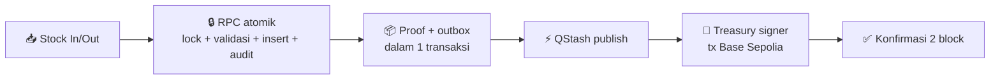
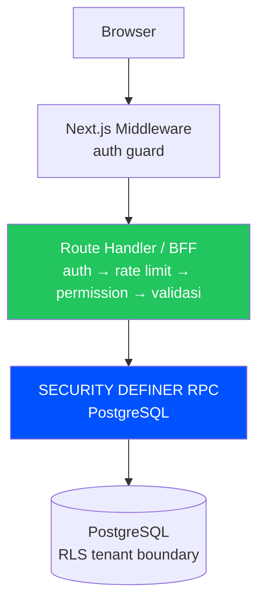
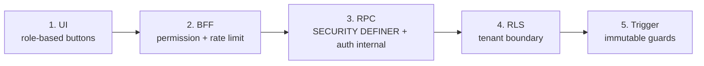

<div align="center">

# 📦⛓️ Chainventory

### Sistem inventaris gudang dengan **bukti blockchain** untuk setiap pergerakan stok penting.

### _Warehouse inventory with verifiable on-chain proof for every critical stock movement._

[](https://github.com/hmwwans12-cpu/Chainventory/releases)
[](https://github.com/hmwwans12-cpu/Chainventory/actions/workflows/ci.yml)
[](https://sepolia.basescan.org)
[](<>)
[](<>)

[🚀 Quick Start](#-quick-start) · [✨ Fitur](#-kenapa-chainventory) · [🏗️ Arsitektur](#️-arsitektur) · [📚 Dokumentasi](#-dokumentasi) · [📦 Releases](https://github.com/hmwwans12-cpu/Chainventory/releases)

</div>

---

## ✨ Kenapa Chainventory?

<table>
<tr>
<td width="50%" valign="top">

### 🏭 Untuk operasional harian

- 🏢 Multi-warehouse + multi-user
- 👥 5 role: Owner → Manager → Staff → Auditor → Viewer
- 📝 Stock in/out, adjustment 4-mata, reversal
- 📥 Bulk import CSV (100 baris/batch, idempoten)
- 🔢 SKU auto-generate + ambang stok rendah + notifikasi
- 🔁 Tombol "ulangi movement" untuk kasir
- 🌏 Bilingual penuh Indonesia / English

</td>
<td width="50%" valign="top">

### 🛡️ Untuk kepercayaan & audit

- 🔗 Proof on-chain tiap movement penting
- 🔍 Audit explorer + link BaseScan per transaksi
- 📊 Status proof live: pending → confirmed
- 🔄 Retry proof + reconciler otomatis
- 📜 Ledger append-only, tak bisa diubah diam-diam
- 🔐 Treasury signer terisolasi, gas transparan

</td>
</tr>
</table>

### 💸 Dua mode proof — dipilihkan otomatis sesuai umur kontrak gudangmu

|                  | 🏛️ Treasury (kontrak v1)             | 👛 Wallet-paid (kontrak v2)         |
| ---------------- | ------------------------------------ | ----------------------------------- |
| **Gas**          | Dibayar treasury — user tinggal klik | Wallet member bayar sendiri         |
| **Cocok untuk**  | Gudang lama / tim non-kripto         | Tim yang mau self-custody penuh     |
| **Estimasi fee** | —                                    | Ditampilkan transparan sebelum sign |

---

## 🔄 Alur Proof (disederhanakan)



<details>
<summary><b>🏗️ Lihat arsitektur sistem lengkap</b></summary>



> Mutation sensitif **tidak pernah** direct table access — selalu lewat RPC dengan otorisasi internal (role + warehouse active + product active). RLS hanya tenant boundary, bukan authorization boundary.

</details>

---

## 🧱 Tech Stack

| Area       | Teknologi                                                                          |
| ---------- | ---------------------------------------------------------------------------------- |
| Frontend   | Next.js 16 App Router · React 19 · TypeScript strict · Tailwind CSS v4 · shadcn/ui |
| Backend    | Supabase (PostgreSQL + Auth + Realtime) · Next.js Route Handlers (BFF)             |
| Blockchain | Base Sepolia · Solidity 0.8.36 · Foundry · OpenZeppelin · viem                     |
| Wallet     | Privy (embedded + external) · custom-auth token dari Supabase                      |
| Async jobs | Upstash QStash (proof pipeline) · Upstash Redis (rate limiting)                    |
| Testing    | Vitest · Testing Library · Playwright · Forge test                                 |
| CI/CD      | GitHub Actions · Vercel                                                            |

## 🚀 Quick Start

```bash
# 1. Clone + install
git clone https://github.com/hmwwans12-cpu/Chainventory.git
cd Chainventory
corepack pnpm install

# 2. Setup environment
cp .env.example .env.local
# isi nilai dari Supabase/Privy/Upstash/QStash dashboard

# 3. Database migrations (butuh SUPABASE_ACCESS_TOKEN)
corepack pnpm db:push:verify

# 4. Run — terminal 1: app, terminal 2: proof worker lokal
corepack pnpm dev
corepack pnpm worker:dev
```

> 💡 **Kenapa 2 terminal?** QStash tidak bisa callback ke `localhost`, jadi worker lokal mengerjakan antrian proof langsung in-process. Di production, QStash yang mengambil alih.

## 🔑 Environment Variables

Lihat `.env.example` untuk daftar lengkap — intinya 6 grup:

| Kategori      | Key utama                                                                                 | Sifat                   |
| ------------- | ----------------------------------------------------------------------------------------- | ----------------------- |
| Supabase      | `NEXT_PUBLIC_SUPABASE_URL`, `NEXT_PUBLIC_SUPABASE_PUBLISHABLE_KEY`, `SUPABASE_SECRET_KEY` | Wajib                   |
| Privy         | `NEXT_PUBLIC_PRIVY_APP_ID`, `PRIVY_APP_SECRET`                                            | Wajib                   |
| Blockchain    | `BASE_SEPOLIA_RPC_URL`, `WAREHOUSE_FACTORY_ADDRESS`, `TREASURY_PRIVATE_KEY`               | Wajib untuk proof       |
| QStash        | `QSTASH_TOKEN`, `QSTASH_*_SIGNING_KEY`                                                    | Wajib untuk proof async |
| Upstash Redis | `UPSTASH_REDIS_REST_URL`, `UPSTASH_REDIS_REST_TOKEN`                                      | Wajib untuk rate limit  |
| Cron          | `CRON_SECRET`                                                                             | Wajib untuk keep-alive  |

⚠️ `NEXT_PUBLIC_APP_URL` harus di-set ke domain produksi saat deploy Vercel.

## 🛠️ Scripts

| Perintah                                        | Fungsi                                        |
| ----------------------------------------------- | --------------------------------------------- |
| `corepack pnpm dev`                             | Development server                            |
| `corepack pnpm worker:dev`                      | Proof outbox worker lokal                     |
| `corepack pnpm build`                           | Production build                              |
| `corepack pnpm typecheck` / `lint` / `test`     | TypeScript / ESLint / Vitest                  |
| `corepack pnpm format:check` / `check:contrast` | Prettier / kontras WCAG                       |
| `corepack pnpm db:push:verify`                  | Push migrasi + verifikasi RPC di schema cache |
| `corepack pnpm e2e:verify` + `e2e:test`         | Playwright (butuh secrets `E2E_*`)            |

## ✅ Testing & Quality Gates

| Layer              | Tool            | Status                                     |
| ------------------ | --------------- | ------------------------------------------ |
| Unit + Integration | Vitest          | 533 passed (live-gated terisolasi)         |
| Kontrak RPC↔DB     | Vitest (statis) | Paritas 44 RPC × migrasi (overload-aware)  |
| Smart Contract     | Forge           | Factory, Warehouse, EIP-712 suites         |
| E2E                | Playwright      | Main flow, console, smoke                  |
| A11y               | check-contrast  | Otomatis (WCAG AA) + preflight 7/7         |
| Supply chain       | deps-audit      | Gate high/critical + allowlist kedaluwarsa |

## 🔒 Security Model



1. **UI**: visibilitas tombol per role (5 roles: OWNER > MANAGER > STAFF > AUDITOR > VIEWER)
2. **BFF**: `requirePermission()` + `requireRateLimit()` + `requireActiveWarehouse()`
3. **RPC**: SECURITY DEFINER dengan otorisasi internal (`auth.uid()` + role + warehouse active)
4. **RLS**: tenant boundary (warehouse_id scoping) — read-only untuk authenticated
5. **Trigger**: warehouse active · product status · warehouse_id immutable · unit immutable

Direct table mutation dari authenticated **ditolak** (INSERT/UPDATE/DELETE revoked).

## 🩹 Dependency Patches

- `patches/@privy-io__react-auth@3.37.1.patch` (via `pnpm patch`, tercatat di `pnpm-workspace.yaml` → `patchedDependencies`): menghapus prop `isActive` yang bocor ke elemen `<div>` di modal TransactionDetails Privy (React 19 warning, temuan audit eksternal 2026-09-13). Prop tersebut tidak dipakai styling mana pun (gaya accordion memakai `data-open`; chevron memakai `isactive` lowercase) sehingga penghapusan nol-perubahan visual/perilaku. **Saat upgrade Privy SDK**: cek apakah upstream sudah tidak melempar `isActive` (cari di `dist/**/TransactionDetails-*`); bila sudah, hapus patch + entri `patchedDependencies`, bila belum, rebase patch ke versi baru.

## 📚 Dokumentasi

| Dokumen                                                            | Isi                                 |
| ------------------------------------------------------------------ | ----------------------------------- |
| [PRD.md](PRD.md)                                                   | Product requirements (frozen v2.1)  |
| [ARSITEKTUR.md](ARSITEKTUR.md)                                     | Technical architecture              |
| [DESIGN.md](DESIGN.md)                                             | Design system & UI/UX spec (§1-84)  |
| [TECHSTACK.md](TECHSTACK.md)                                       | Technology decisions                |
| [WORKFLOW.md](WORKFLOW.md)                                         | Development workflow                |
| [AGENT.md](AGENT.md)                                               | Operating manual untuk AI/developer |
| [TODO.md](TODO.md)                                                 | Implementation tracker              |
| [Releases](https://github.com/hmwwans12-cpu/Chainventory/releases) | Catatan rilis per versi             |

## 🚢 Deployment

Deploy ke Vercel:

1. Push ke `main` → CI otomatis (typecheck + lint + test + build)
2. Set environment variables di Vercel Project Settings
3. Set `NEXT_PUBLIC_APP_URL` ke domain produksi
4. Tambahkan domain ke Supabase Auth → URL Configuration

Branch protection: `main` memerlukan check `quality` (strict).

---

<div align="center">

**Dibuat untuk UMKM Indonesia 🇮🇩 — inventaris rapi, audit berani.**

⭐ Star repo ini kalau membantu · 🐛 Lapor bug via Issues

</div>
