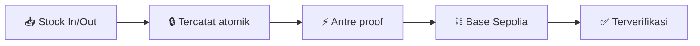
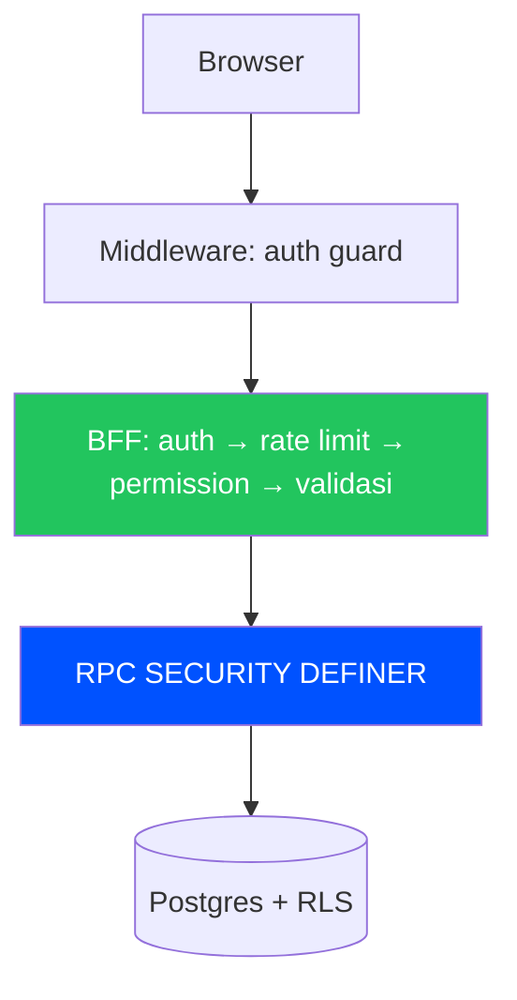

<div align="center">

# 📦⛓️ Chainventory

### Inventaris gudang dengan **bukti blockchain** di setiap pergerakan stok penting.

### _Warehouse inventory with verifiable on-chain proof for every critical movement._

[](https://github.com/hmwwans12-cpu/Chainventory/releases)
[](https://github.com/hmwwans12-cpu/Chainventory/actions/workflows/ci.yml)
[](https://sepolia.basescan.org)
[](<>)
[](<>)

**Stok masuk/keluar → tercatat → di-anchor on-chain → terverifikasi di BaseScan.**

[🚀 Mulai](#-mulai-3-menit) · [✨ Fitur](#-fitur-utama) · [🏗️ Arsitektur](#️-arsitektur) · [📚 Dokumen](#-dokumen)

</div>

---

## ✨ Fitur utama

<table>
<tr>
<td width="50%" valign="top">

### 🏭 Operasional

- 🏢 Multi-warehouse + multi-user
- 👥 5 role: Owner → Viewer
- 📝 Stock in/out, adjustment 4-mata, reversal
- 📥 Bulk CSV idempoten + SKU auto-generate
- 🔔 Ambang stok rendah + notifikasi
- 🔁 Ulangi movement sekali klik
- 🌏 Bilingual Indonesia / English

</td>
<td width="50%" valign="top">

### 🛡️ Kepercayaan & audit

- 🔗 Proof on-chain tiap movement penting
- 🔍 Audit explorer + link BaseScan
- 📊 Status proof live + retry + reconciler
- 📜 Ledger append-only anti-diam-diam
- ⏱️ Estimasi fee transparan sebelum sign
- 🔐 Treasury signer terisolasi

</td>
</tr>
</table>

### 💸 Dua mode proof — dipilihkan otomatis

|            | 🏛️ Treasury (kontrak v1) | 👛 Wallet-paid (kontrak v2)    |
| ---------- | ------------------------ | ------------------------------ |
| Gas        | Treasury yang bayar      | Wallet sendiri                 |
| Rasa pakai | Tinggal klik             | Sign + lihat estimasi fee dulu |



## 🚀 Mulai (3 menit)

```bash
git clone https://github.com/hmwwans12-cpu/Chainventory.git && cd Chainventory
corepack pnpm install
cp .env.example .env.local  # isi dari dashboard Supabase/Privy/Upstash
corepack pnpm db:push:verify
corepack pnpm dev           # + terminal 2: corepack pnpm worker:dev
```

> Worker kedua hanya untuk dev lokal (QStash tak bisa callback ke localhost).

## 🏗️ Arsitektur



Tanpa direct table access. Detail lengkap: [ARSITEKTUR.md](ARSITEKTUR.md).

## 🧱 Tech stack

Next.js 16 · React 19 · TypeScript strict · Tailwind v4 · shadcn/ui · Supabase (Postgres + Auth + Realtime) · Base Sepolia · Solidity 0.8.36 · Foundry · Privy · Upstash QStash + Redis · Vitest · Playwright

## ✅ Kualitas

533 test hijau · paritas 44 RPC↔DB · Forge suites · E2E Playwright · WCAG AA otomatis · deps-audit gate · preflight 7/7 · `next build` bersih.

<details>
<summary><b>🔑 Environment & scripts</b></summary>

Supabase (`*_URL`, `*_PUBLISHABLE_KEY`, `SECRET_KEY`) · Privy (`APP_ID`, `APP_SECRET`) · Blockchain (`RPC_URL`, `FACTORY_ADDRESS`, `TREASURY_PRIVATE_KEY`) · QStash (`TOKEN`, signing keys) · Redis (`URL`, `TOKEN`) · Cron (`CRON_SECRET`). Lengkap: `.env.example`. Produksi: set `NEXT_PUBLIC_APP_URL` + domain Supabase Auth.

`dev` · `worker:dev` · `build` · `typecheck` · `lint` · `test` · `format:check` · `check:contrast` · `db:push:verify` · `e2e:*`

</details>

<details>
<summary><b>🔒 Model keamanan (5 lapis)</b></summary>

Tombol per-role → BFF (permission + rate limit) → RPC SECURITY DEFINER → RLS tenant boundary → trigger immutable.

</details>

<details>
<summary><b>🩹 Patch dependensi</b></summary>

`patches/@privy-io__react-auth@3.37.1.patch` menghapus prop `isActive` bocor (React 19 warning). Saat upgrade Privy: cek `dist/**/TransactionDetails-*`, hapus patch bila upstream bersih.

</details>

## 📚 Dokumen

[PRD](PRD.md) · [Arsitektur](ARSITEKTUR.md) · [Desain](DESIGN.md) · [Techstack](TECHSTACK.md) · [Workflow](WORKFLOW.md) · [Releases](https://github.com/hmwwans12-cpu/Chainventory/releases)

🚢 Deploy: push `main` → CI → env Vercel → `NEXT_PUBLIC_APP_URL` + domain Auth. Branch `main` terproteksi (`quality` strict).

---

<div align="center">

**Dibuat untuk UMKM Indonesia 🇮🇩** · ⭐ Star kalau membantu · 🐛 Lapor via Issues

</div>
