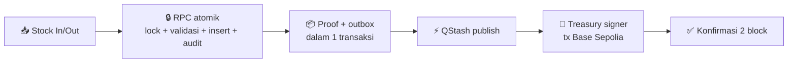
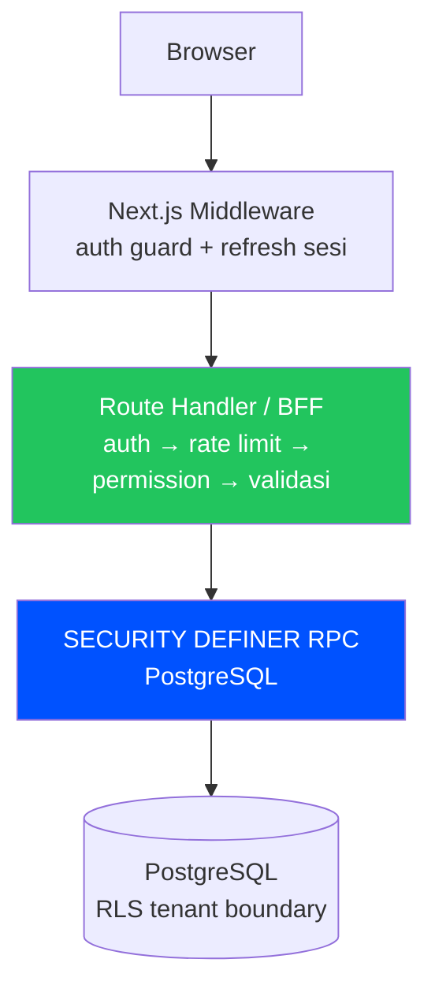
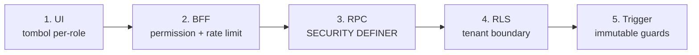

<div align="center">

# 📦⛓️ Chainventory

### Inventaris gudang dengan **bukti blockchain** di setiap pergerakan stok penting.

### _Warehouse inventory with verifiable on-chain proof for every critical movement._

[](https://github.com/hmwwans12-cpu/Chainventory/releases)
[](https://github.com/hmwwans12-cpu/Chainventory/actions/workflows/ci.yml)
[](https://sepolia.basescan.org)
[](<>)
[](<>)

**Stok masuk/keluar → tercatat → di-anchor on-chain → terverifikasi di BaseScan.**

[🚀 Mulai](#-mulai-3-menit) · [✨ Fitur](#-fitur-utama) · [🏗️ Arsitektur](#️-arsitektur) · [🛠️ Scripts](#️-scripts) · [📚 Dokumen](#-dokumen)

</div>

---

## ✨ Fitur utama

<table>
<tr>
<td width="50%" valign="top">

### 🏭 Operasional harian

- 🏢 Multi-warehouse + multi-user dalam satu tim
- 👥 5 role berjenjang: Owner → Manager → Staff → Auditor → Viewer
- 📝 Stock in/out, adjustment 4-mata (maker-checker), reversal
- 📥 Bulk import CSV idempoten (≤100 baris/batch) + SKU auto-generate
- 🔔 Ambang stok rendah + notifikasi harian ke Owner/Manager
- 🔁 Tombol "ulangi movement" — prefill produk + qty otomatis
- 🌏 Antarmuka bilingual penuh Indonesia / English
- 📴 Banner offline + indikator realtime di header

</td>
<td width="50%" valign="top">

### 🛡️ Kepercayaan & audit

- 🔗 Proof on-chain otomatis tiap movement penting
- 🔍 Audit explorer + link BaseScan per transaksi
- 📊 Status proof live: pending → submitted → confirmed
- 🔄 Retry proof (developer + Owner/Manager, budget gas ketat)
- 🧹 Reconciler + worker lokal untuk antrean macet
- 📜 Ledger append-only — riwayat tak bisa diubah diam-diam
- ⏱️ Estimasi fee transparan sebelum tanda tangan
- 🔐 Treasury signer terisolasi (bukan owner gudang)

</td>
</tr>
</table>

### 💸 Dua mode proof — dipilihkan otomatis sesuai umur kontrak gudangmu

|                     | 🏛️ Treasury (kontrak v1)     | 👛 Wallet-paid (kontrak v2)     |
| ------------------- | ---------------------------- | ------------------------------- |
| **Siapa bayar gas** | Treasury — user tinggal klik | Wallet member sendiri           |
| **Cocok untuk**     | Gudang lama / tim non-kripto | Tim yang mau self-custody penuh |
| **UX**              | Tanpa popup wallet           | Popup sign + estimasi fee dulu  |
| **Konfirmasi**      | Polling 2 block → confirmed  | Sama, via intent terverifikasi  |



## 🚀 Mulai (3 menit)

```bash
# 1. Clone + install
git clone https://github.com/hmwwans12-cpu/Chainventory.git
cd Chainventory
corepack pnpm install

# 2. Setup environment (isi dari dashboard Supabase/Privy/Upstash/QStash)
cp .env.example .env.local

# 3. Migrasi database (butuh SUPABASE_ACCESS_TOKEN)
corepack pnpm db:push:verify

# 4. Jalan — DUA terminal:
corepack pnpm dev          # aplikasi (localhost:3000)
corepack pnpm worker:dev   # worker proof lokal
```

> 💡 **Kenapa 2 terminal?** QStash (production) tidak bisa callback ke `localhost`, jadi saat dev, worker lokal mengerjakan antrean proof langsung in-process. Perintahnya menolak jalan di production.

## 🏗️ Arsitektur



Mutation sensitif **tidak pernah** direct table access — selalu lewat RPC dengan otorisasi internal (role + warehouse active + product active). RLS hanya tenant boundary, bukan authorization boundary. Detail: [ARSITEKTUR.md](ARSITEKTUR.md).

## 🧱 Tech Stack

| Area       | Teknologi                                                                          |
| ---------- | ---------------------------------------------------------------------------------- |
| Frontend   | Next.js 16 App Router · React 19 · TypeScript strict · Tailwind CSS v4 · shadcn/ui |
| Backend    | Supabase (PostgreSQL + Auth + Realtime) · Next.js Route Handlers (BFF)             |
| Blockchain | Base Sepolia · Solidity 0.8.36 · Foundry · OpenZeppelin · viem                     |
| Wallet     | Privy embedded + external · custom-auth token dari sesi Supabase                   |
| Async jobs | Upstash QStash (proof pipeline) · Upstash Redis (rate limiting)                    |
| Testing    | Vitest (533) · Testing Library · Playwright E2E · Forge                            |
| CI/CD      | GitHub Actions (`quality` strict) · Vercel + Cron                                  |

## 🔑 Environment Variables

Lihat `.env.example` untuk daftar lengkap + komentar per key:

| Kategori      | Key utama                                                                                 | Sifat                   |
| ------------- | ----------------------------------------------------------------------------------------- | ----------------------- |
| Supabase      | `NEXT_PUBLIC_SUPABASE_URL`, `NEXT_PUBLIC_SUPABASE_PUBLISHABLE_KEY`, `SUPABASE_SECRET_KEY` | Wajib                   |
| Privy         | `NEXT_PUBLIC_PRIVY_APP_ID`, `PRIVY_APP_SECRET`                                            | Wajib                   |
| Blockchain    | `BASE_SEPOLIA_RPC_URL`, `WAREHOUSE_FACTORY_ADDRESS`, `TREASURY_PRIVATE_KEY`               | Wajib untuk proof       |
| QStash        | `QSTASH_TOKEN`, `QSTASH_CURRENT/NEXT_SIGNING_KEY`                                         | Wajib untuk proof async |
| Upstash Redis | `UPSTASH_REDIS_REST_URL`, `UPSTASH_REDIS_REST_TOKEN`                                      | Wajib untuk rate limit  |
| Cron          | `CRON_SECRET` (≥16 char)                                                                  | Wajib untuk keep-alive  |

⚠️ `NEXT_PUBLIC_APP_URL` harus = domain produksi saat deploy Vercel. Jangan pernah set `SKIP_ENV_VALIDATION` di production.

## 🛠️ Scripts

| Perintah                                | Fungsi                                                  |
| --------------------------------------- | ------------------------------------------------------- |
| `corepack pnpm dev`                     | Development server                                      |
| `corepack pnpm worker:dev`              | Proof outbox worker lokal (poll tiap 15 dtk)            |
| `corepack pnpm build`                   | Production build                                        |
| `corepack pnpm typecheck`               | TypeScript strict (`tsc --noEmit`)                      |
| `corepack pnpm lint`                    | ESLint                                                  |
| `corepack pnpm test`                    | Vitest full suite                                       |
| `corepack pnpm format:check`            | Prettier check                                          |
| `corepack pnpm check:contrast`          | Kontras warna WCAG AA otomatis                          |
| `corepack pnpm deps:audit`              | Gate CVE high/critical + allowlist kedaluwarsa          |
| `corepack pnpm db:push:verify`          | Push migrasi + verifikasi RPC di schema cache PostgREST |
| `corepack pnpm e2e:verify` / `e2e:test` | Verifikasi env + Playwright (butuh secrets `E2E_*`)     |

## ✅ Testing & Quality Gates

| Layer              | Tool              | Status                                     |
| ------------------ | ----------------- | ------------------------------------------ |
| Unit + Integration | Vitest            | 533 passed (live-gated terisolasi)         |
| Kontrak RPC↔DB     | Vitest (statis)   | Paritas 44 RPC × migrasi (overload-aware)  |
| Smart Contract     | Forge             | Factory, Warehouse, EIP-712 suites         |
| E2E                | Playwright        | Main flow, console, smoke                  |
| A11y               | check-contrast    | Otomatis (WCAG AA) + preflight 7/7         |
| Supply chain       | deps-audit        | Gate high/critical + allowlist kedaluwarsa |
| Release            | preflight + build | Typecheck, lint, test, build prod          |

## 🔒 Security Model (5 lapis)



1. **UI**: visibilitas tombol per role (OWNER > MANAGER > STAFF > AUDITOR > VIEWER)
2. **BFF**: `requirePermission()` + `requireRateLimit()` + `requireActiveWarehouse()` (+ suspend menolak semua mutasi)
3. **RPC**: SECURITY DEFINER, EXECUTE hanya `service_role`, actor eksplisit per panggilan
4. **RLS**: tenant boundary (warehouse_id scoping) — authenticated read-only
5. **Trigger/guard**: warehouse active · product status · warehouse_id immutable · unit immutable · satu active per owner

Direct table mutation dari authenticated **ditolak** (INSERT/UPDATE/DELETE revoked).

## 🩹 Dependency Patches

- `patches/@privy-io__react-auth@3.37.1.patch` (via `pnpm patch` → `patchedDependencies`): menghapus prop `isActive` yang bocor ke `<div>` di modal TransactionDetails Privy (React 19 warning, temuan audit 2026-09-13). Nol-perubahan visual/perilaku. **Saat upgrade Privy SDK**: cari `isActive` di `dist/**/TransactionDetails-*`; bila sudah bersih, hapus patch + entrinya, bila belum, rebase.

## 📚 Dokumentasi

| Dokumen                                                            | Isi                                 |
| ------------------------------------------------------------------ | ----------------------------------- |
| [PRD.md](PRD.md)                                                   | Product requirements (frozen v2.1)  |
| [ARSITEKTUR.md](ARSITEKTUR.md)                                     | Technical architecture              |
| [DESIGN.md](DESIGN.md)                                             | Design system & UI/UX spec (§1-84)  |
| [TECHSTACK.md](TECHSTACK.md)                                       | Technology decisions                |
| [WORKFLOW.md](WORKFLOW.md)                                         | Development workflow + runbook      |
| [AGENT.md](AGENT.md)                                               | Operating manual untuk AI/developer |
| [TODO.md](TODO.md)                                                 | Implementation tracker              |
| [Releases](https://github.com/hmwwans12-cpu/Chainventory/releases) | Catatan rilis per versi             |

## 🚢 Deployment

1. Push ke `main` → CI otomatis (typecheck + lint + test + build, gate `quality` strict di branch protection)
2. Set environment variables di Vercel Project Settings
3. Set `NEXT_PUBLIC_APP_URL` ke domain produksi
4. Tambahkan domain ke Supabase Auth → URL Configuration

---

<div align="center">

**Dibuat untuk UMKM Indonesia 🇮🇩 — inventaris rapi, audit berani.**

⭐ Star kalau membantu · 🐛 Lapor bug via Issues · 📦 [Lihat semua rilis](https://github.com/hmwwans12-cpu/Chainventory/releases)

</div>
