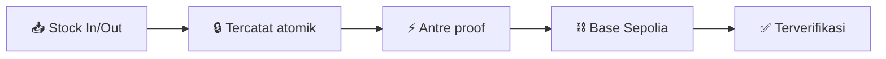

<div align="center">

# 📦⛓️ Chainventory

### Inventaris gudang dengan **bukti blockchain** di setiap pergerakan stok penting.

[](https://github.com/hmwwans12-cpu/Chainventory/releases)
[](https://github.com/hmwwans12-cpu/Chainventory/actions/workflows/ci.yml)
[](https://sepolia.basescan.org)
[](<>)

**Stok masuk/keluar → tercatat → di-anchor on-chain → terverifikasi di BaseScan.**

[🚀 Mulai](#-mulai-3-menit) · [📦 Releases](https://github.com/hmwwans12-cpu/Chainventory/releases) · [📚 Dokumen](#-dokumen)

</div>

---

## ✨ Isinya apa?

- 🏭 **Multi-gudang + 5 role** — Owner, Manager, Staff, Auditor, Viewer
- 🔗 **Proof on-chain otomatis** tiap movement penting (treasury bayar gas, atau wallet sendiri di kontrak v2)
- 🔍 **Audit explorer** + link BaseScan per transaksi
- 📥 **Bulk CSV**, SKU auto-generate, peringatan stok rendah
- 🌏 **Indonesia / English** penuh



## 🚀 Mulai (3 menit)

```bash
git clone https://github.com/hmwwans12-cpu/Chainventory.git && cd Chainventory
corepack pnpm install
cp .env.example .env.local  # isi dari dashboard Supabase/Privy/Upstash
corepack pnpm db:push:verify
corepack pnpm dev           # + terminal 2: corepack pnpm worker:dev
```

> Worker kedua hanya untuk dev lokal (QStash tak bisa callback ke localhost).

<details>
<summary><b>🧱 Tech stack</b></summary>

Next.js 16 · React 19 · TypeScript strict · Tailwind v4 · shadcn/ui · Supabase (Postgres + Auth + Realtime) · Base Sepolia · Solidity 0.8.36 · Foundry · Privy · Upstash QStash + Redis · Vitest · Playwright

</details>

<details>
<summary><b>🔑 Environment (6 grup)</b></summary>

Supabase (`*_URL`, `*_PUBLISHABLE_KEY`, `SECRET_KEY`) · Privy (`APP_ID`, `APP_SECRET`) · Blockchain (`RPC_URL`, `FACTORY_ADDRESS`, `TREASURY_PRIVATE_KEY`) · QStash (`TOKEN`, signing keys) · Redis (`URL`, `TOKEN`) · Cron (`CRON_SECRET`). Detail: `.env.example`. Jangan lupa `NEXT_PUBLIC_APP_URL` = domain produksi saat deploy.

</details>

<details>
<summary><b>🛠️ Scripts & quality gates</b></summary>

`dev` · `worker:dev` · `build` · `typecheck` · `lint` · `test` (533 hijau) · `format:check` · `check:contrast` (WCAG AA) · `db:push:verify` · `e2e:*`

</details>

<details>
<summary><b>🔒 Model keamanan (5 lapis)</b></summary>

Tombol per-role → BFF (permission + rate limit) → RPC SECURITY DEFINER → RLS tenant boundary → trigger immutable. Tanpa direct table access.

</details>

## 📚 Dokumen

[PRD](PRD.md) · [Arsitektur](ARSITEKTUR.md) · [Desain](DESIGN.md) · [Techstack](TECHSTACK.md) · [Workflow](WORKFLOW.md) · [Releases](https://github.com/hmwwans12-cpu/Chainventory/releases)

🚢 Deploy: push `main` → CI → set env di Vercel → set `NEXT_PUBLIC_APP_URL` + domain Supabase Auth.

---

<div align="center">

**Dibuat untuk UMKM Indonesia 🇮🇩** · ⭐ Star kalau membantu · 🐛 Lapor via Issues

</div>
